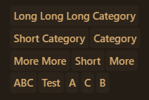

# Simple-Masonry

## Installation

To install execute the command:

```shell
npm install simple-masonry-ui
```

## Usage

### Horizontal-Masonry

```typescript jsx
import {HorizontalMasonry} from "simple-masonry-ui";

// Horizontal Masonry Example
<HorizontalMasonry gap={0.5}>
    <CategoryBadge text="Long Long Long Category"/>
    <CategoryBadge text="Short Category"/>
    <CategoryBadge text="Category"/>
    <CategoryBadge text="Test"/>
    <CategoryBadge text="Short"/>
    <CategoryBadge text="A"/>
    <CategoryBadge text="B"/>
    <CategoryBadge text="C"/>
    <CategoryBadge text="ABC"/>
    <CategoryBadge text="More"/>
    <CategoryBadge text="More More"/>
</HorizontalMasonry>
```



## License

Simple-Masonry is released under the MIT License. See the bundled [LICENSE](LICENSE) file for details.